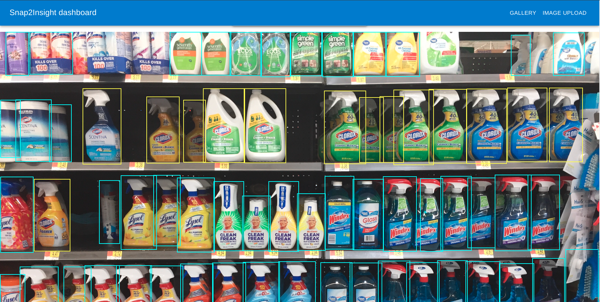

# React-frontend

This is the frontend application of my solution, a
web application that interacts with user, facilitating
image upload, listing images and geting detailed information
with insights on the selected image,

## Install

### pre-requisites

To run this application, the user must have **Node** version > `16`.
I am using `v18.17.0`, so that is an idea case.

Simple install, just use

```shell
npm install
```
Now that we have all things set up, we start application.
To run the application in `dev` mode, we use
```
npm start
```
This commands starts a basic react development server.


For production builds, we build this application and serve the
`/html` file and its chunks from `/build` directory. This can be done using
```shell
npm run build
serve -s build
```
---

### Components and where to find them?
This application has a file upload component and a gallery component.


#### Image upload components
The Image upload component takes care of uploading file and its detection file.
It is located on the index route or "/"


#### Gallery component
The Gallery component, located at `/gallery` route is a component that contains
both our `<Masonry/>` component that hosts all the images and out image details component.

We are using a state variable `selectedImage` to store our selected image for analysis
and rendering a component among our `<Masonry/>` and Image details component.

Landing page for our gallery component is our `<Masonry/>` component that looks like the following:


Once we click on any image, a detailed analysis page opens up that displays
marked image based on dictations, brand graphs, a level analysis graph(based on the selected brand).




---

### Important Information
All the tasks mentioned in the assignment are covered.
Due to Time constraints, The code structure for gallery compromised.
This is a trade-off for a well-coupled design between frontend and backend system.
